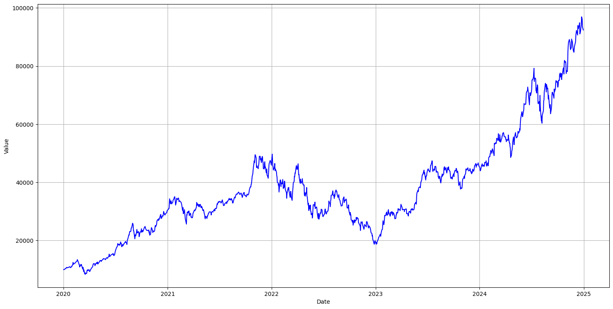

# Investment-Portfolio
## Description
This is a simple Python script to simulate an investment portfolio and visualize its historical perfomance over time.
## Functionalities
- Define your portfolio with specific weights for each ticker
- Set an initial investment amount
- Automatically download historical price data via yfinance
- Calculate the historical value of the portfolio
- Plot the portfolio's value over time using a line chart

## Libraries
- yfinance
- pandas
- matplotlib.pyplot

## Example output
Here is a sample simulation of the portfolio performance:



## How to run
1. Clone the repository:
   ```bash
   git clone https://github.com/your-username/investment-portfolio.git

   

